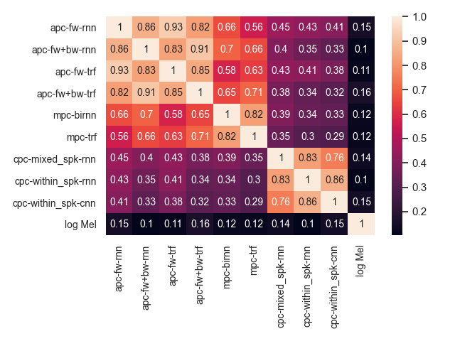
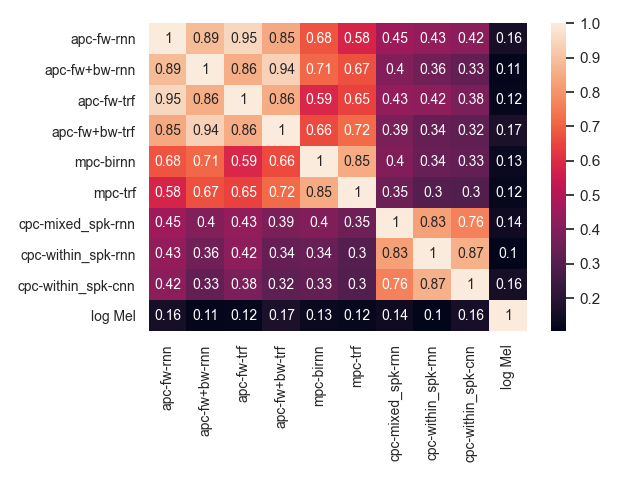
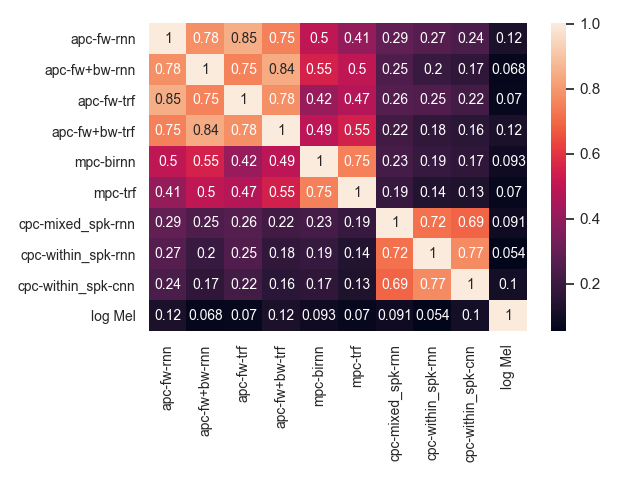

# Similarity Analysis of Self-Supervised Speech Representations

The repository contains the supplementary materials that correspond to Section 4 of our ICASSP'21 paper: "[Similarity analysis of self-supervised speech representations](https://arxiv.org/abs/2010.11481)". In the paper, due to the space limit we are only able to present the similarity heatmap of `lincka` on the Wall Street Journal (WSJ) corpus. Here we include the similarity heatmaps of `lincka` on TIMIT, `svcca` on WSJ, and `svcca` on TIMIT.

  
   

Similarity heatmaps of `lincka` on WSJ (left) and TIMIT (right). Similarity values are annotated.

  
   

Similarity heatmaps of `svcca` on WSJ (left) and TIMIT (right). Similarity values are annotated.

We find all heatmaps exhibiting consistent patterns regardless of the probing corpus (WSJ and TIMIT) and similarity measure (`lincka` and `svcca`), which reveal the following insights (please check paper for more detailed descriptions):
* Objective affects similarity more than architecture.
* Directionality affects similarity more than building block.
* Source of negative samples affects similarity more than architecture.
